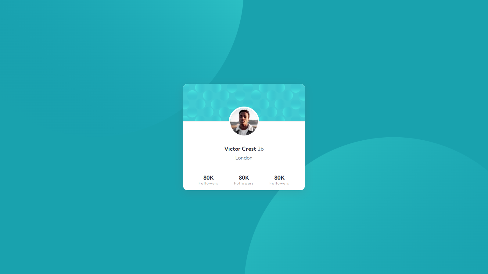

# Profile-card-component---Frontend-Mentor

This is a solution to the [Profile card component challenge hub](https://www.frontendmentor.io/challenges/profile-card-component-cfArpWshJ/hub/profile-card-component-GHsOYpBBv). Frontend Mentor challenges help you improve your coding skills by building realistic projects. 

## Table of contents

- [Overview](#overview)
  - [The challenge](#the-challenge)
  - [Links](#links)
- [My process](#my-process)
  - [Built with](#built-with)
- [Author](#author)

## Overview

### The challenge

Your users should be able to:

  •View the optimal layout depending on their device's screen size

### Links

- Solution URL: [Link](https://www.frontendmentor.io/solutions/profile-card-component-5-dR3pkY9)
- Live Site URL: [Link](https://thelaucha.github.io/Profile-card-component---Frontend-Mentor/)

## My process

### Built with

- Semantic HTML5 markup
- CSS custom properties
- Flexbox
- CSS Grid
- [React](https://reactjs.org/) - JS library
- [Styled Components](https://styled-components.com/) - For styles

## Author

- Website - [Lautaro Espinillo](https://thelaucha.github.io/portfolio_web/)
- Frontend Mentor - [@TheLaucha](https://www.frontendmentor.io/profile/TheLaucha)
